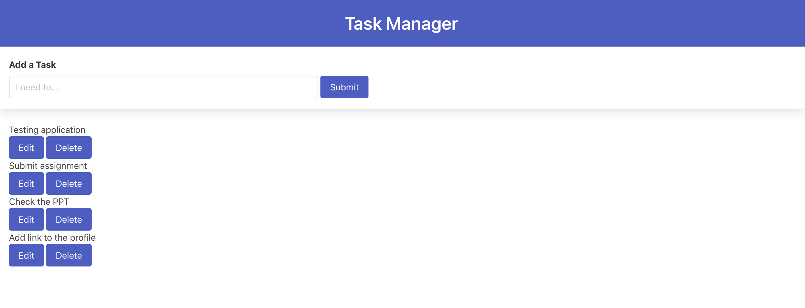
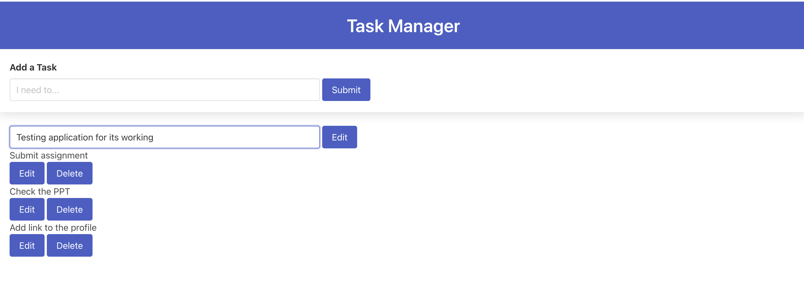
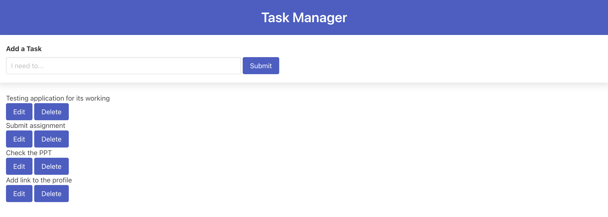
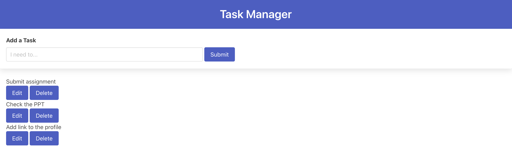

# Task Manager

## Description

The simple task manager application helps us to manage everyday tasks or activities. The single-page application was developed using HTML, CSS, JS technology, and third-party APIs like jQuery, Bulma CSS, and Dayjs. To manage the activities, one must log in to the application. The application offers Google authentication using Firebase and gathers user data for tracking activities for the user. It uses the Firebase firestore database to store and maintain the data in the cloud, which enables one to use the application on any browser. Herewith, the application uses two external APIs of the Firebase for authentication and storage service. However, the application also uses the browser's local storage feature to store the data locally.

## Installation

N/A

## Usage

To access the webpage, use the given link  https://vigneshwarie.github.io/G6-Task-Manager/

The application source code can be accessed using the link https://github.com/Vigneshwarie/G6-Task-Manager

The code can be downloaded from the above link. To use this webpage, click the HTML page, which will open in the browser. The view the code, open the webpage in an HTML editor. When opened in a browser, the HTML page is viewed as below.

During editing

After Edit

After Delete

## API Details

API Keys and other configuration details can be accessed from the JS files located in the repo.

A detailed documentation for Google authentication can be found under the link, https://firebase.google.com/docs/auth/web/google-signin?authuser=0&hl=en

The detailed documentation on Cloud Firestore can be found under the link, https://firebase.google.com/docs/firestore

## Credits

We have used Bulma CSS for styling the application, https://cdn.jsdelivr.net/npm/bulma@0.9.4/css/bulma.min.css

Modal Alert is based Bulma CSS, https://bulma.io/documentation/components/modal/

Documentation links supporting various operations like Add, Edit, Delete and Get data are listed below

Add and Edit - https://firebase.google.com/docs/firestore/manage-data/add-data

Delete - https://firebase.google.com/docs/firestore/manage-data/delete-data

Get Data - https://firebase.google.com/docs/firestore/query-data/get-data

Documentation on Awaits and Module

https://developer.mozilla.org/en-US/docs/Web/JavaScript/Reference/Operators/await
https://developer.mozilla.org/en-US/docs/Web/JavaScript/Guide/Modules

## License

Please refer to the LICENSE in the repo.